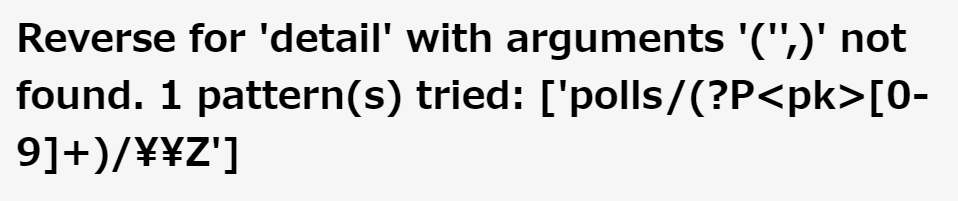

Djangoチュートリアルも、かなり大詰めにはいってきました。みなさん元気にdjangoしてますでしょうか 
  
  

今回は、前回出てきたテンプレートをゴリゴリ書いていきます。detailページは今のところ選択肢が出ているだけですが、ここから選択肢を選んで投票できるように、投票フォームをつくっていきます。 

テンプレートを書く前に、プログラミング&HTMLコーディング初心者の方向けに、formタグの基本構造をおさらいしておきます。テンプレートを入れると見た目がごちゃごちゃしてしまうので。慣れている方も一旦おさらいしましょう。  
```html
<form action="送信先のURL" method="get/post">
    <div>
        名前 <input type="text" name="name">
    </div>
    <div>
        メールアドレス <input type="text" name="email">
    </div>
    <div>
        問い合わせ内容 
    </div>
    <input type="button" value="送信">
</form>
```
<p class="codepen" data-height="300" data-default-tab="html" data-slug-hash="VwVrmOW" data-user="ricky-sensei" style="height: 300px; box-sizing: border-box; display: flex; align-items: center; justify-content: center; border: 2px solid; margin: 1em 0; padding: 1em;">
  <span>See the Pen <a href="https://codepen.io/ricky-sensei/pen/VwVrmOW">
  Untitled</a> by ricky-sensei (<a href="https://codepen.io/ricky-sensei">@ricky-sensei</a>)
  on <a href="https://codepen.io">CodePen</a>.</span>
</p>
<script async src="https://cpwebassets.codepen.io/assets/embed/ei.js"></script>    

formタグのmethodプロパティを見てみましょう。
## getとpost
クライアントからサーバーにリクエストをする場合の、HTTPメソッドです。
### get:サーバーから情報ちょうだい！  
サーバーから単に情報をもらうだけなのがgetメソッド  
### post:サーバー側に情報をあげる！  
今回のようにformから情報をサーバーに渡し、それをDBに登録したりする場合に使います。他にもブログ記事投稿やユーザーの追加などで使います。  

これを踏まえた上で、detail.htmlを編集していきましょう。  
```html:polls/templates/polls/ddddddddddddddddddddddddddddddddd
<html lang="ja">
<head>
    <meta charset="UTF-8">
    <title>Title</title>
</head>
    <form action="" method="post">
        <fieldset>
            <legend><h1>{{ question.question_text }}</h1></legend>
            
                <p><strong>{{ error_message }}</strong></p>
            

            
                <input type="radio" name="choice" id="choice{{ forloop.counter }}" value="{{ choice.id }}">
                <label for="choice{{ forloop.counter }}">{{ choice.choice_text }}</label> <br>
            
        </fieldset>
        <input type="submit" value="投票">
    </form>
</html>
```
  
この中で、初心者敵にあまり見かけないタグは、legendタグくらいでしょうか。lengendタグは伝説のタグ、ではなく、各fieldsetに対しての説明文を入れたりするタグです。  
  
pythonライクな書き方とhtmlが混在しているようなカタチで、最初は分かりずらいかもしれませんが、大体何が書いてあるか分かりますでしょうか。  
error_messageというパラメータを確認し。それがtrueならエラー文を表示、そうでなければfor文を用いて選択肢を表示します。  
urls.pyで、vote関数がこうなっていましたね。name=voteとしているから、で指定できることを思い出してください。（前回参照）
  
```python:urls.py
path("<int:question_id>/vote/", views.vote, name="vote"),
```  
views.pyののviews関数を編集しましょう。  
ついでに。get_object_or_404やrenderのショートカットを使いましょう。  
```python:views.py

# 追加
from django.http import HttpResponse, HttpResponseRedirect
from django.shortcuts import get_object_or_404, render
# 追加
from django.urls import reverse
# 追加
from .models import Choice, Question 

def vote(request, question_id):
    question = get_object_or_404(Question, pk=question_id)
    try:
        # request.Post にchoiceがあった場合、そのidを文字列として返す
        selected_choice = question.choice_set.get(pk=request.POST["choice"])
    except (KeyError, Choice.DoesNotExist):
        # request.Post にchoiceがなかったとき、エラーメッセージを返す
        # formから入力内容を再表示
        return render(
            request,
            "polls/detail.html",
            {
                "question": question,
                "error_message": "You didn't select a choice.",
            },
        )
    else:
        selected_choice.votes += 1
        selected_choice.save()
         
        # reverse関数で、関数名からURLを逆引きし、そのURLにリダイレクトする。戻るボタンを使って2回送信されることを防ぐとこができる。
        return HttpResponseRedirect(reverse("polls:results", args=(question.id,)))
```  
reverse関数は、ハードコードを防ぐのにも一役買っています。reverse("polls:results", args=(question.id))は、"polls/3/results"を返します。  

現在、voteのページはこんな感じになってるはずです。
  
投票をクリックしたあとに結果ページに飛ぶんですが、そのビューを書いていきましょう。  
  
```python:views.py
...

def results(request, question_id):
    question = get_object_or_404(Question, pk=question_id)
    return render(request, "polls/results.html", {"question":question})
```  
results.htmlをご指名なので、テンプレートをつくっていきましょう。  
```html:polls/results.html
<!DOCTYPE html>
<html lang="en">
<head>
    <meta charset="UTF-8">
    <title>results</title>
</head>
<body>
    <h1>{{ question.question_text }}</h1>
    <ul>
        
            <li>{{ choice.choice_text }} -- {{ choice.votes }} vote{{ choice.votes | pluralize }}</li>
        
    </ul>
    <a href="">もう一度投票する？</a>
</body>
</html>
```  
日本語サイトではほとんど使うことはないかもしれませんが、読んで頂いてるみなさんはだいぶテンプレートに慣れてきて,{{ choice.votes | pluralize }}ってなんじゃい、って思う方も多いと思いますので、一応解説しとくと,
はるか昔ピカピカの中学一年生のときに英語でならったあの「複数形」にしてくれる機能です。djangoにわざわざこの機能いる？って思ったりしますが、欧米のみなさんにはダイジな機能なんでしょう。許してあげてください。  
  

# レッツリファクタリング
### urlconfの修正  
index →IndexViewのように、ビューの名前を変更します。また、question_idとpkが混在しているので、pkに統一します。as_viewですが、クラスベースのviewを参照するときに使います。(後述)

```python:urls.py
urlpatterns = [
    path("", views.IndexView.as_view(), name="index"),
    path("<int:pk>/", views.DetailView.as_view(), name="detail"),
    path("<int:pk>/result/", views.ResultView.as_view(), name="results"),
    path("<int:question_id>/vote/", views.VoteView.as_view(), name="vote"),
]
```  
次に,views.pyを編集します。  
編集前のdetailとresultsのビューを見てみると、とてもシンプルなビューなのに、冗長な書き方になっています。今のviews.pyは関数ベースの書き方担っていますが、クラスを使った書き方に変更し、デフォルトで用意されているビューを使うことで、コードを短縮していきます。  

```python:views.py
from django.http import HttpResponseRedirect
from django.shortcuts import get_object_or_404, render
from django.urls import reverse
from django.views import generic

from .models import Choice, Question


class IndexView(generic.ListView):
    template_name = "polls/index.html"
    context_object_name = "latest_question_list"

    def get_queryset(self):
        """Return the last five published questions."""
        return Question.objects.order_by("-pub_date")[:5]


class DetailView(generic.DetailView):
    model = Question
    template_name = "polls/detail.html"


class ResultsView(generic.DetailView):
    model = Question
    template_name = "polls/results.html"


def vote(request, question_id):
    ...  # same as above, no changes needed.
```  
チュートリアルにはいろいろ書いてありますが、とりあえず簡単にまとめると、django.viesのgenericの中の、ListViewとDetailViewというビューを使っている、ということと、ぞれぞでデータの渡し方がきまっており、例えばDetailViewでは「PK」という名前でプライマリキーを渡すことが決まっているので、先程question_idからpkに変えたわけです。  
それぞれデフォルトのテンプレートも用意されていますが、template_nameを指定することで、自分で用意したテンプレートを使うことができます。  
  
私が一回やったミスなのですが、class ResultsView(generic.DetailView):のところ、誤ってgeneric.ListViewとしてしまって、  
  
というエラーが出ました。当然ですが、それぞれの汎用viewで要求されている引数の種類が違う、ということですね。  

ここであんまりそれぞれの汎用ビューにこだわりすぎると、djangoの本質を見失うことになりかねないので、初心者の方はとりあえず一旦おいておくことをオススメします。次行きましょ次！気になる人は先輩の言う通り[ここ](https://docs.djangoproject.com/ja/4.2/topics/class-based-views/)でも覗いてみればいいんじゃないでしょうか。    

---  
無事投稿機能が実装できました！ここいらで一旦その1に戻って、自分の手で実装してみるのもいいかもしれません。 自分が作ることを想定した投票機能にしてみるとか。  
では、その5に続きます。


